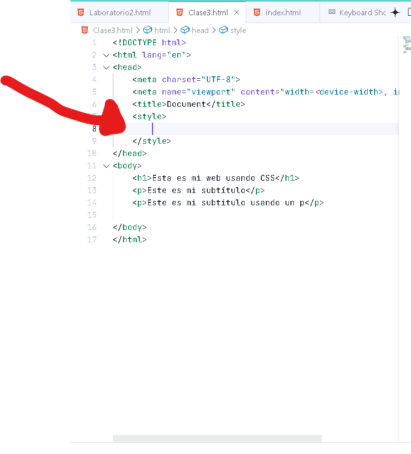

# Code 101 - Enter Tech
## HTML
### Crear estructura básica HTML

- Digitar signo de admiración ( ! ) y luego darle a enter

- Tamaño de la fuente :**font-size**
- Grosor de la fuentefont: **weight** 
-  tamaño de caja en alto : **heigt**
-  Ancho de caja : **width** 
- *Cuando no colocas el valor de width y height ,por defecto está en “auto” significando el maximo posible del documento*
- grosor del borde : **border** 
- color de fondo: **background-color** 
- Espacio entre las cajas de abajo: **margin-bottom**
- *Normalizar , es para mantener tal cual tu formato como lo estas desarrollando y no verse afectado por estandares externos*
- border-radius : ** % o px**

  ### Enlace tutariales
  1. [Tutorial 1](https://www.w3schools.com/html/)
  2. [Tutorial 2](https://tutorialehtml.com/es/tutoriales-html-tutorial-html-completo/)
 
  | Markdown | HTML |
|--------------|--------------|
| Lenguaje de marcado ligero para formatear texto de forma sencilla.      | Lenguaje de marcado para estructurar y diseñar páginas web complejas.|
|Basada en caracteres , más simple y rápida de escribir.|Basada en etiquetas, más extensa y detallada.|
|ideal para contenido básico y documentación.| permite controlar casi todos los aspectos del diseño y estructura.|
